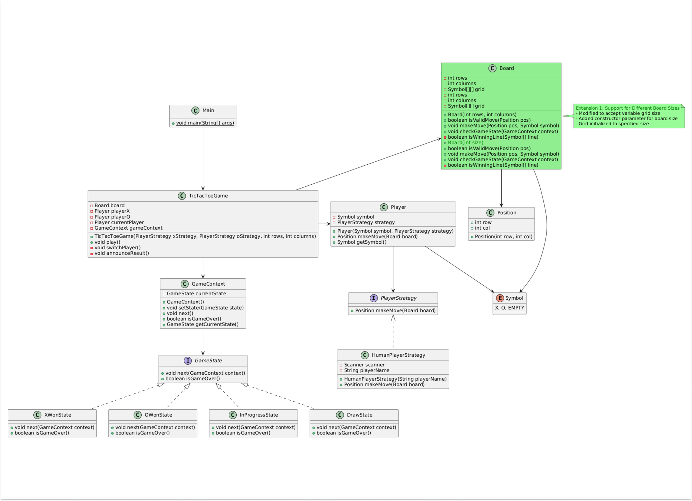

# Tic-Tac-Toe Game



## Overview

This project is a modular, extensible implementation of the classic Tic-Tac-Toe game in Java. It demonstrates clean separation of concerns, use of design patterns, and support for custom strategies and board sizes.

## Features

- **Human vs Human gameplay** (AI strategies can be added easily)
- **Customizable board size**
- **Clear, modular architecture**
- **Extensible for new features and strategies**

---

## Architecture & Design Patterns

### 1. **Strategy Pattern**
- Used for player move logic. Each player uses a [`PlayerStrategy`](src/Game/PlayerStrategies/PlayerStrategy.java) interface, allowing for different move strategies (e.g., human, AI).
- Example: [`HumanPlayerStrategy`](src/Game/PlayerStrategies/Concrete_Player_Strategy/HumanPlayerStrategy.java)

### 2. **State Pattern**
- Used for managing game states (X's turn, O's turn, win, draw, etc.) via the [`GameState`](src/Game/GameStateHandlers/GameState.java) interface and its concrete implementations:
  - [`XTurnState`](src/Game/GameStateHandlers/Concrete_States/XTurnState.java)
  - [`OTurnState`](src/Game/GameStateHandlers/Concrete_States/OTurnState.java)
  - [`XWonState`](src/Game/GameStateHandlers/Concrete_States/XWonState.java)
  - [`OWonState`](src/Game/GameStateHandlers/Concrete_States/OWonState.java)
  - [`DrawState`](src/Game/GameStateHandlers/Concrete_States/DrawState.java)
- Managed by [`GameContext`](src/Game/GameStateHandlers/Context/GameContext.java)

### 3. **Separation of Concerns**
- Game logic, board management, player strategies, and state transitions are all handled in separate, focused classes.

---

## Key Components

- **Entry Point:** [`App.java`](src/App.java)
- **Game Controller:** [`TicTacToeGame`](src/Game/Controller/Game_Controller/TicTacToeGame.java)
- **Board Representation:** [`Board`](src/Game/Utilities/Board.java)
- **Player Representation:** [`Player`](src/Game/Utilities/Player.java)
- **Position Representation:** [`Position`](src/Game/Utilities/Position.java)
- **Symbol Enum:** [`Symbol`](src/Game/CommonEnums/Symbol.java)
- **Player Strategy Interface:** [`PlayerStrategy`](src/Game/PlayerStrategies/PlayerStrategy.java)
- **Human Player Strategy:** [`HumanPlayerStrategy`](src/Game/PlayerStrategies/Concrete_Player_Strategy/HumanPlayerStrategy.java)
- **Game State Handlers:**  
  - [`GameState`](src/Game/GameStateHandlers/GameState.java)  
  - [`GameContext`](src/Game/GameStateHandlers/Context/GameContext.java)  
  - Concrete states:  
    - [`XTurnState`](src/Game/GameStateHandlers/Concrete_States/XTurnState.java)  
    - [`OTurnState`](src/Game/GameStateHandlers/Concrete_States/OTurnState.java)  
    - [`XWonState`](src/Game/GameStateHandlers/Concrete_States/XWonState.java)  
    - [`OWonState`](src/Game/GameStateHandlers/Concrete_States/OWonState.java)  
    - [`DrawState`](src/Game/GameStateHandlers/Concrete_States/DrawState.java)

---

## How to Run

1. Compile all Java files in the `src/` directory.
2. Run the `App` class.

```sh
javac src/**/*.java
java -cp src App
```

---

## Key Strengths

1. **Simplicity:** Minimal and straightforward design.
2. **Clarity:** Easy to understand and maintain.
3. **Efficiency:** Direct and logical implementation for smooth gameplay.
4. **Separation of Concerns:** Each component has a clear responsibility.
5. **Extensibility:**  
   - Supports different board sizes  
   - Easy to add new player strategies (e.g., AI)  
   - Scalable for varied gameplay

---

## Extending the Game

- **Add AI:** Implement the [`PlayerStrategy`](src/Game/PlayerStrategies/PlayerStrategy.java) interface with your own logic.
- **Change Board Size:** Modify the board size in [`App.java`](src/App.java) when creating the `TicTacToeGame` instance.

---

## License

This project is for educational purposes.